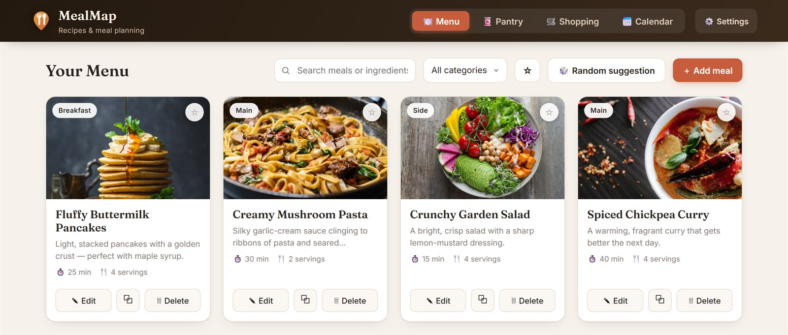

# MealMap



> I quickly threw together this app with AI for my own use. But I thought I may as well put it online
> in case anyone else finds it useful. There is no back end — I did not want to host anything or deal
> with all that. So your data stays in your browser: export it, or link a file and let your own cloud
> storage keep it in sync.

**A meal planner with no back end.** Recipes, a pantry, a shopping list that writes itself from the
week's plan, and a calendar you can drag meals around on.

No build step. No framework. No npm. No account, no server, no tracking. Plain HTML, CSS and
JavaScript — download the folder, open `index.html`, and it works, straight off the disk.

**It makes no third-party requests.** The two libraries and both fonts are vendored, so nothing is
fetched from anyone else's server, nothing can be blocked by a strict CSP, and no visitor's IP is
handed to a CDN. The only outbound requests are ones you cause: an AI import you asked for, a sync
you set up, or a recipe photo you linked.

`~4,600 lines` · `no build` · `7 languages` · `261 tests` · `no third-party requests`

<!-- Worth adding when there is time: cook mode and the calendar mid-drag. -->

## Try it

### → **[eecs.blog/BlazorApps/MealMap](https://eecs.blog/BlazorApps/MealMap)**

Nothing to sign up for. It starts with a few sample recipes so there is something to look at, and
everything you do stays in your own browser.

Or download the folder and open `index.html` — that is the entire installation, and it runs straight
off the disk. Note that the AI import and OneDrive sync need it served over `http(s)://` rather than
`file://`; see [Running it](#running-it) below.

## What it does

**🍽️ Menu** — recipes with photos, ingredients, steps, nutrition and a link back to the source.
Search covers ingredients, not just titles, and tells you *which* ingredient matched. A servings
stepper rescales every quantity (`500 g ×3` becomes `1.5 kg`, not `1500 g`) without ever rewriting
the stored recipe.

**🥫 Pantry** — what you have in. Ingredients you already own get a ✓ badge on the recipe, and the
shopping list leaves them out. The matcher understands plurals, declensions and synonyms, so
*"Eggs"* covers *"1 egg"*, *"aubergine"* finds *"eggplant"* — and *"Milk"* deliberately does **not**
cover *"buttermilk"* or *"coconut milk"*.

**🛒 Shopping** — built from any range of the calendar. Quantities are added up when they genuinely
can be (`2 cloves` + `3 cloves` → `5 cloves`, `200 g` + `1 kg` → `1.2 kg`) and left as separate
lines when they can't, because a wrong total is worse than two lines. It counts *cooking sessions*,
so a batch cooked once counts once however many days it spans. **⤴ Share** takes the finished list
out of the browser five ways — clipboard, the OS share sheet, a `.txt` file, a pre-filled email in
your own mail app, or a **QR code you scan with a phone**. The QR is generated on your device by
[`js/qr.js`](js/qr.js); no list is ever posted to a code-generating service.

**📅 Calendar** — plan meals into breakfast / lunch / dinner / snack. Drag them between days with a
mouse or a finger. **Batch cook** once and eat it across several days, with leftovers linked back to
the day you cooked and shown as such.

**▤ Cook mode** — one recipe, full screen, no chrome. Tap a line to strike it off, and the screen
stays awake while you cook. Ctrl-P prints a clean one-page card.

**✨ AI import** — paste a recipe or a link and let Claude, ChatGPT or Gemini fill the form in,
including the photo, source URL and nutrition. It writes the recipe **in whatever language the app
is set to**, so an English page becomes a Slovenian recipe your Slovenian pantry can actually match.
Bring your own API key; it stays in your browser and is never included in exports or sync.

**🌍 Seven languages** — English, Slovenian, Spanish, French, German, Italian, Portuguese.
**Metric ⇄ imperial** is display-only, so switching back and forth never damages a recipe.

## Where your data lives

**In your browser, and nowhere else.** There is no account and no server. Nothing is uploaded
anywhere unless you choose to set up syncing.

The flip side: clearing your browsing data, switching browser, or moving to another device starts
you over. So keep a copy. Three ways, in order of how little setup they need:

| | Setup | Works on |
|---|---|---|
| **Export / Import a file** | none | everything |
| **Keep a file up to date** | pick a file, once | Chrome, Edge, Opera — desktop |
| **OneDrive live sync** | app registration — see [`docs/ONEDRIVE-SETUP.md`](docs/ONEDRIVE-SETUP.md) | everything, once hosted |

**Keep a file up to date** is the one most people should use. Point it at a file inside a folder
OneDrive, Dropbox, Google Drive or iCloud already syncs, and whatever syncs that folder keeps your
recipes in step across your machines. No account, no keys, nothing to register — it uses the
[File System Access API](https://developer.mozilla.org/en-US/docs/Web/API/File_System_API), so the
app holds a handle to your file and rewrites it; your existing cloud client does the rest.

Storage is `localStorage`, overflowing to IndexedDB when photos outgrow the ~5 MB quota.

## Running it

Double-click `index.html`, or serve the folder:

```bash
node serve.js
```

Then open <http://localhost:8765>. A local server is the better option — browser storage behaves
normally there, and the AI and OneDrive features refuse to run from `file://`.

`serve.js` is a 30-line static server with no `npm install`, so it works offline.

### Hosting it

Copy `index.html`, `css/`, `js/`, `lib/`, `fonts/` and `.htaccess` to any static host. That is the
whole deployment — there is nothing to build and no runtime to install.

`.htaccess` is worth keeping. None of the filenames are content-hashed, so a long cache on
`index.html` or `js/` cannot be busted from inside the app, and a host that defaults to a generous
`max-age` will leave returning visitors on an old copy for months. Worse than the staleness is the
mixing: `index.html` and the scripts are fetched at slightly different moments, so they can expire at
different moments, and a visitor can end up running new markup against stale code. The file tells
Apache and LiteSpeed to revalidate the code every time — a repeat visit costs a 304, not a
re-download — and to cache only the fonts long-term, since they are the one thing here that never
changes.

Other hosts ignore it and need the same policy expressed their own way: nginx `add_header`, an S3
object's `Cache-Control` metadata, Netlify `_headers`. GitHub Pages already does the right thing.

## Tests

```bash
node serve.js
```

Then open <http://localhost:8765/tests.html>. **286 unit and end-to-end tests** run automatically
and report inline — no runner to install, no build, matching how the rest of the project works.

Roughly two thirds are unit tests over the pure logic: quantity parsing and arithmetic, shopping-list
combining, recipe scaling, unit conversion, the ingredient matcher, dates, the batch model, storage,
the QR encoder, and translation parity across all seven languages. The rest drive the real UI in an
iframe — CRUD, search, cook mode, dragging chips with **both** mouse and touch gestures, batch
cooking, sharing the shopping list — plus the AI and OneDrive paths behind a fake `fetch`. A few pin
how the app is assembled: that the scripts stay classic and in order, that the fonts and libraries
really are local, and that nothing is fetched from a third party.

The suite replaces `putKey`, the single choke point for every write, so **no test can reach your
saved data**. Two of the tests assert exactly that.

## Browser support

The app itself runs anywhere modern. Three features degrade rather than break:

| Feature | Needs |
|---|---|
| Keep a file up to date | Chrome / Edge / Opera on desktop — the section hides itself elsewhere |
| Screen stays awake in cook mode | Wake Lock API — not Safari; fails silently and the hint stops promising it |
| Everything else | any current browser, desktop or mobile |

## How it's built

Vanilla JavaScript — no framework, no bundler, no `package.json`, nothing to install. The markup is
`index.html`; the styling is one stylesheet; the code is nine plain `<script>` files loaded in order.
State is four arrays and an object; the UI is template strings and `innerHTML`. Translations are a
flat `I18N` table with exact key parity enforced by a test.

Two things about the JavaScript are deliberate and worth knowing before you rearrange it:

- They are **classic scripts, not modules**, so every top-level `let`/`const` lives in one shared
  global scope. That is what lets the files talk to each other without any import wiring.
- Because of that, **load order matters**. Function declarations hoist within a file but not across
  files, so a file whose top level calls something must come after the file that defines it. The
  order in `index.html` is the order the code was written in, and the test suite catches it if that
  breaks.

The point of all this is that the thing keeps working with no toolchain — drop the folder somewhere
and open it, now or in ten years.

## Repository

| File | What it is |
|---|---|
| [`index.html`](index.html) | The markup, and the only page you open |
| [`.htaccess`](.htaccess) | Cache headers for Apache/LiteSpeed hosts — see [Running it](#running-it) |
| [`css/`](css) | The styling, plus the vendored font declarations |
| [`js/`](js) | The application, in ten files loaded in order |
| [`lib/`](lib) | Two vendored libraries — see [`lib/README.md`](lib/README.md) |
| [`fonts/`](fonts) | Fraunces and Inter — see [`fonts/README.md`](fonts/README.md) |
| [`tests.html`](tests.html) | The test suite — open it in a browser |
| [`serve.js`](serve.js) | Dependency-free static server |
| [`docs/USER-GUIDE.md`](docs/USER-GUIDE.md) | How to use the app, screen by screen |
| [`docs/ARCHITECTURE.md`](docs/ARCHITECTURE.md) | Full technical notes: architecture, data model, and every design decision with its reasoning |
| [`docs/ONEDRIVE-SETUP.md`](docs/ONEDRIVE-SETUP.md) | Step-by-step for the optional OneDrive sync |
| [`UNLICENSE`](UNLICENSE) | Public domain dedication |

**Start with [`docs/ARCHITECTURE.md`](docs/ARCHITECTURE.md) if you are picking up the code.** It
explains not just what the code does but what was tried, what broke, and why things ended up the way
they are — including the bugs that were subtle enough to be worth writing down. The repo's history
was squashed into one commit, so that file is now the only record of the reasoning.

## Contributing

Edit the file in [`js/`](js) that owns the behaviour — `index.html` is markup only. There is nothing
to install and nothing to build.

Three habits worth keeping:

- **Run the tests before and after.** They are fast and they have caught more than one change that
  looked obviously correct.
- **Add a translation key to all seven languages at once.** A test fails if you don't, but it is much
  less annoying to do it up front.
- **Don't turn the scripts into modules, and don't reorder them.** They share one global scope on
  purpose; a test will tell you if that breaks, but the reason is worth knowing first —
  see [`docs/ARCHITECTURE.md`](docs/ARCHITECTURE.md).

## Status

Personal project, actively used. The AI import is verified against live Gemini; **OneDrive sync is
written and tested up to the network boundary but has never run against real Microsoft servers** —
see [`docs/ONEDRIVE-SETUP.md`](docs/ONEDRIVE-SETUP.md) for a step-by-step test plan if you set it up.

## License

[The Unlicense](UNLICENSE) — this is released into the public domain. Copy it, change it, sell it,
ship it, no attribution needed. Take the whole thing and make it yours.

The vendored files are the exception and keep their own licences: [`lib/`](lib) is MIT and
Apache-2.0, [`fonts/`](fonts) is the SIL Open Font License. See
[`lib/README.md`](lib/README.md) and [`fonts/README.md`](fonts/README.md).
